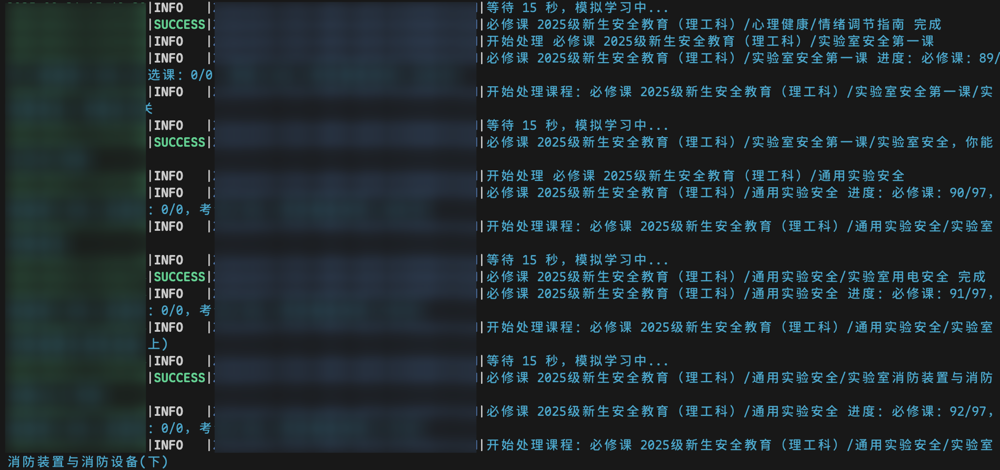
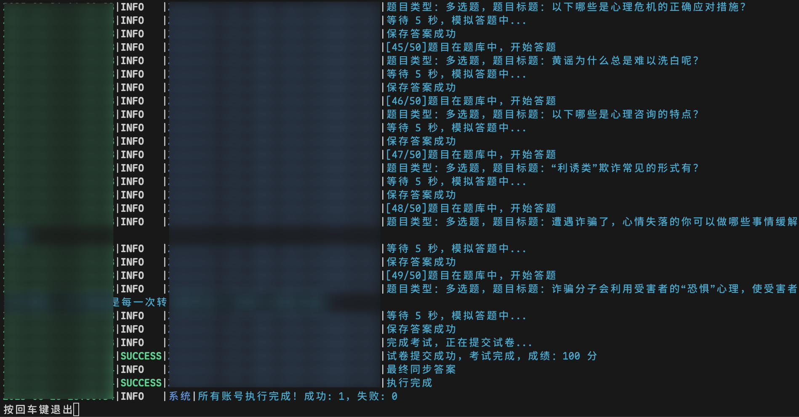
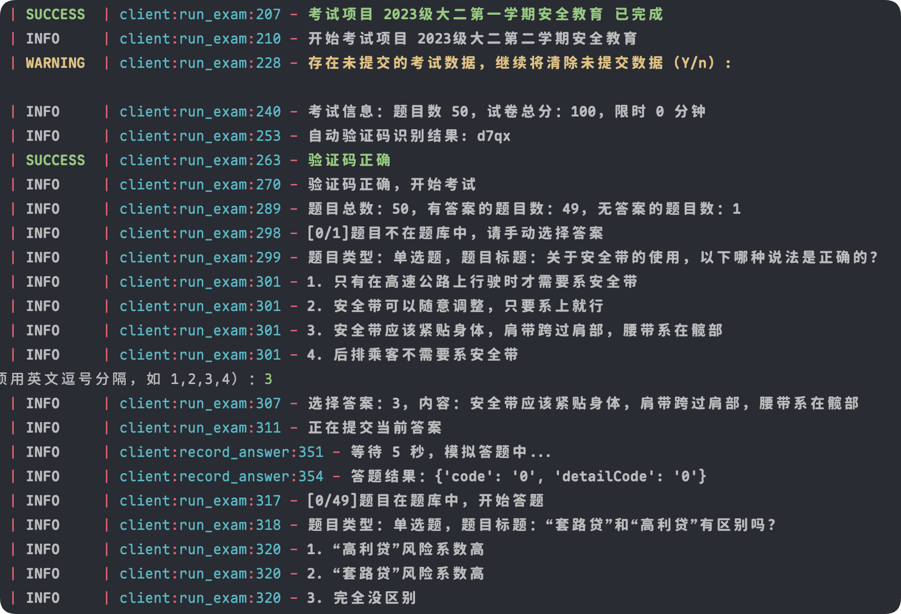
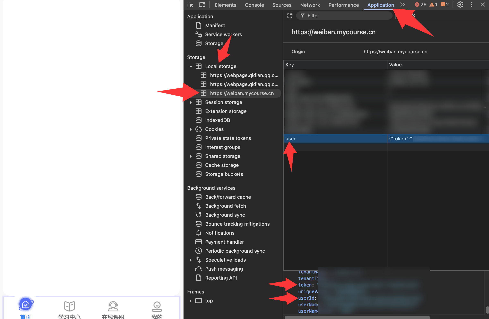
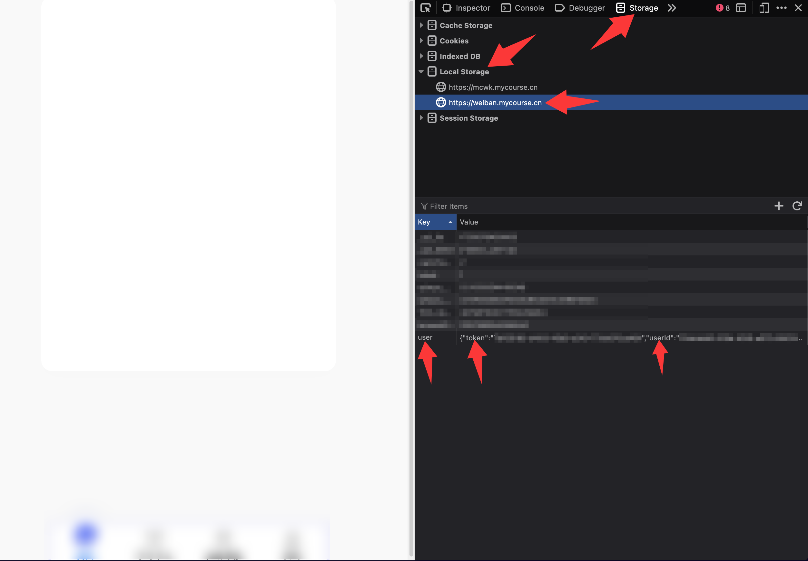

# _WeBan_Tool_ 安全微课 安全微伴 大学安全教育（合并增强版）

## 介绍

如果本项目帮到了你，可以在右上角点亮 Star，谢谢你！

本仓库以 [hangone/WeBan](https://github.com/hangone/WeBan) 为主干，合并了
[konakona418/WeibanCourseHelper](https://github.com/konakona418/WeibanCourseHelper)
的轻量完课验证码破解技巧，实现了课程学习和根据题库自动考试，支持多用户多线程运行、自动验证码识别等。

运行前后会自动合并题库，如果一次没满分可以再考一次。可将 `answer/answer.json` 文件提交 PR 一起完善题库。

## 相比原版的改进（合并内容）

- **轻量完课验证码**：吸收 WeibanCourseHelper 的"纯请求固定坐标点选破解"技巧，完课时优先调用
  `getCaptcha/checkCaptcha` 接口（不启动浏览器），失败再回退浏览器自动化。通过配置
  `course_captcha_mode` 控制行为：`api`（纯请求，最快）/ `browser`（浏览器自动化，最稳）/ `auto`（先 api 后浏览器，默认）
- **离线分发**：移除了联网更新检查和远程配置模板下载，首次运行直接用打包内置的模板生成 `config.toml`，完全离线可用
- **一键打包**：新增 `build.bat`，Windows 本机一条命令即可打包单文件 exe
- **已同步上游 v3.10.1**：按项目交替学习+考试（修复扁平列表边学边翻漏学）、CLI 参数 + `WB_` 环境变量、
  无交互模式（Docker/cron 自动判定）、题库扩充、考试无感验证码处理等

## 功能特性

- **课程学习**：自动遍历项目 → 分类 → 课程，模拟翻页、答题、等待学习时长后完课；按项目交替完成课程与考试
- **自动考试**：基于题库自动答题，支持单选/多选，未匹配题目可随机作答或手动输入
- **验证码识别**：登录验证码 OCR 自动识别；课程点选验证码自动识别（无头浏览器 + OpenCV，默认 2 轮 × 3 次），失败才转手动；完课验证码默认走轻量请求破解（不弹浏览器），失败自动回退浏览器自动化
- **多账号并发**：支持配置多个账号，可多线程同时执行
- **题库同步**：考试前后自动从服务器同步题库，支持多用户共享
- **断点续考**：追求满分模式下，一次未满分可再次考试
- **进度监控**：完课后自动检查进度是否更新，未更新则警告提示
- **调试模式**：开启 `debug` 可查看完整请求/响应日志
- **无交互运行**：Docker / cron / 后台环境自动无交互，数据目录持久化
- **低配兼容**：numpy 1.26 + OpenCV 4.10 锁定，兼容无 AVX2 的 QEMU 虚拟 CPU（便宜 1H1G 云服务器可跑）

## 使用

> **零基础三步上手**：① 下载二进制文件 → ② 双击/命令行运行 → ③ 输入学校、学号、密码。不需要安装 Python，不需要写代码。

### ⭐ 快速开始（推荐：下载即用）

**第 1 步：下载你的系统对应的文件**

点这里打开最新版下载页 → [**Releases**](https://github.com/ECXiaobai/WeBan_Tool/releases/latest)，按自己的电脑系统下载（不确定系统就按下面的表选；本 fork 目前只发布 Windows 版，Mac/Linux 请用源码运行或 Docker）：

| 你的电脑 | 点击下载（GitHub） | 下载太慢用镜像 |
|---------|-------------------|---------------|
| Windows（绝大多数电脑） | [WeBan-windows-x64.exe](https://github.com/ECXiaobai/WeBan_Tool/releases/latest/download/WeBan-windows-x64.exe) | [镜像](https://gh-proxy.com/https://github.com/ECXiaobai/WeBan_Tool/releases/latest/download/WeBan-windows-x64.exe) |

> Windows 用户也可本地自行打包：`cmd /c build.bat`（产物生成在 `dist\WeBan-windows-x64.exe`，需 Python 3.12+ 和 pyinstaller）。

**第 2 步：运行**

- **Windows**：双击 `WeBan-windows-x64.exe`（第一次运行如被 SmartScreen 拦截，点"更多信息" → "仍要运行"；杀毒软件误报请添加信任）

**第 3 步：填账号，开始**

第一次运行（或还没有配置文件时），程序会**直接让你输入学校、学号、密码**（不用编辑任何文件）：

```
请输入账号信息：
  学校全称（如：北京交通大学-本科生）: 北京交通大学-本科生
  用户名（学号）: <你的账号>
  密码（默认同用户名）: <你的密码>
```

输入后程序会**自动验证账号**：登录成功就会把账号自动保存到配置文件 `config.toml`，然后开始学习和考试；**如果学校全称或用户名密码错了，会提示你重新输入，不会写坏配置文件**。之后每次运行都会接着上次的进度继续。

> 配置文件 `config.toml` 在程序旁边（Windows 是 exe 所在文件夹，Mac/Linux 是运行命令的目录），下次运行前也可以手动改它。用 `--data-dir` 可以指定固定位置（见下方参数表）。

**不想交互输入？一条命令直接跑**（学校/学号/密码写在命令里，无需配置文件）：

```powershell
# Windows (PowerShell)
$env:WB_TENANT_NAME="你的学校全称"; $env:WB_USERNAME="你的学号"; $env:WB_PASSWORD="你的密码"; .\WeBan-windows-x64.exe
```

> 全部参数对照表见下方"参数总览"；账号想保密的、或一个文件管理多个账号的，用配置文件方式。

### 参数总览

**每个配置项都有命令行参数和环境变量两种方式，三类名称一一对应**：配置文件键名（`snake_case`）= 命令行参数（`--kebab-case`）= 环境变量（`WB_SNAKE_CASE`），例如 `study_time` ↔ `--study-time` ↔ `WB_STUDY_TIME`。优先级均为 **命令行 > 环境变量 > 配置文件**：

| 配置文件键 | 参数 | 环境变量 | 说明 |
|-----------|------|---------|------|
| — | `--config PATH` | `WB_CONFIG` | 配置文件路径（默认: 程序目录/config.toml） |
| — | `--data-dir PATH` | `WB_DATA_DIR` | 数据目录（config/logs/answer 都在此，适合挂载） |
| — | `--non-interactive` | — | 无交互模式（环境变量用 `ENVIRONMENT=docker`/`container` 或 stdin 非 TTY 自动判定） |
| `study_mode` | `--study-mode` | `WB_STUDY_MODE` | 学习模式（`false`/`true`/`force`） |
| `exam_mode` | `--exam-mode` | `WB_EXAM_MODE` | 考试模式（`false`/`true`/`perfect`/`force`） |
| `random_answer` | `--random-answer` | `WB_RANDOM_ANSWER` | 题库外题目是否随机作答（`true`/`false`） |
| `study_time` | `--study-time SEC` | `WB_STUDY_TIME` | 每门课学习时长 `"基础,随机上限"`（秒），如 `"20,5"` |
| `video_speed` | `--video-speed N` | `WB_VIDEO_SPEED` | 视频课程倍速：`0`=不按视频时长等待、`1`=原速、`2`=半速 |
| `exam_question_time` | `--exam-question-time SEC` | `WB_EXAM_QUESTION_TIME` | 每道考试题答题等待时长 `"基础,随机上限"`（秒） |
| `exam_submit_match_rate` | `--exam-submit-match-rate N` | `WB_EXAM_SUBMIT_MATCH_RATE` | 允许交卷的最低题库匹配率（百分比） |
| `browser_path` | `--browser-path PATH` | `WB_BROWSER_PATH` | 浏览器可执行文件路径 |
| `cdp_host` | `--cdp-host HOST` | `WB_CDP_HOST` | CDP 浏览器地址 |
| `cdp_port` | `--cdp-port PORT` | `WB_CDP_PORT` | CDP 浏览器端口 |
| `jupiter_fallback` | `--jupiter-fallback` | `WB_JUPITER_FALLBACK` | 对未加载 apicenext.js 的课程是否补发 jupiter 翻页轨迹 |
| `max_workers` | `--max-workers N` | `WB_MAX_WORKERS` | 多账号最大并发数 |
| `debug` | `--debug` | `WB_DEBUG` | 启用调试日志 |
| `tenant_name` | `--tenant-name NAME` | `WB_TENANT_NAME` | 单账号学校全称（免配置文件） |
| `username` | `--username USER` | `WB_USERNAME` | 单账号用户名 |
| `password` | `--password PASS` | `WB_PASSWORD` | 单账号密码（默认同用户名） |
| `user_id` | `--user-id ID` | `WB_USER_ID` | 单账号用户 ID（Token 登录） |
| `token` | `--token TOKEN` | `WB_TOKEN` | 单账号登录 Token（配合 `--tenant-name --user-id`） |
| `[ai].enable` | `--ai-enable` | `WB_AI_ENABLE` | 是否启用 AI 搜题（`true`/`false`） |
| `[ai].base_url` | `--ai-base-url URL` | `WB_AI_BASE_URL` | AI 服务 API 基础路径 |
| `[ai].api_key` | `--ai-api-key KEY` | `WB_AI_API_KEY` | AI 服务 API Key |
| `[ai].model` | `--ai-model NAME` | `WB_AI_MODEL` | AI 模型名称 |
| `[ai].timeout` | `--ai-timeout SEC` | `WB_AI_TIMEOUT` | AI 请求超时秒数 |
| `[ai].max_retries` | `--ai-max-retries N` | `WB_AI_MAX_RETRIES` | AI 请求失败最大重试次数 |

无交互自动判定：`ENVIRONMENT=docker`（或 container）、stdin 非 TTY（cron/后台/管道）、或显式 `--non-interactive`。

**完全不写 config.toml 也能运行**（单账号 + 全部设置走 CLI/env）：

```powershell
# 环境变量
$env:WB_TENANT_NAME="你的学校全称"; $env:WB_USERNAME="你的学号"; $env:WB_PASSWORD="你的密码"; $env:WB_STUDY_TIME="20,5"; $env:WB_VIDEO_SPEED=0; .\WeBan-windows-x64.exe
# 或等价的命令行参数
.\WeBan-windows-x64.exe --tenant-name "你的学校全称" --username 你的学号 --study-time "20,5" --video-speed 0
```

### 源码运行

不需要代码基础的用户**跳过本节**（直接下载二进制即可）。开发者/想改代码时用：

1. 安装 Python 3.12+（建议使用 [uv](https://github.com/astral-sh/uv)）和 Git

2. 克隆本仓库

```bash
git clone https://github.com/ECXiaobai/WeBan_Tool
```

3. 安装依赖

```bash
pip install -r requirements.txt
```

4. 运行

```bash
python main.py
```

运行 `python main.py --help` 可查看全部参数。

### Docker

提供两种镜像变体（多架构 amd64/arm64，发布时随版本推送）：

| 镜像 | Tag | 说明 |
|------|-----|------|
| 内置浏览器 | `latest` / `with-browser` / `<版本号>` | 内置 headless Chrome，开箱即用 |
| 轻量镜像 | `without-browser` / `<版本号>-without-browser` | 通过 CDP 连接宿主机浏览器 |

容器默认无交互运行（`ENVIRONMENT=docker` 自动判定），数据全部持久化在 `/app/data`：

```bash
mkdir -p data
docker run --rm \
  -v "$PWD/data":/app/data \
  --cpus 1 \
  hangyi/weban:latest
```

- 建议 `--cpus 1`（详见下方"CPU 配额与验证码"）；首次运行会在 `./data/` 生成 `config.toml` 模板，填写账号后重新运行即可
- 日志在 `./data/logs/<账号>/`，题库在 `./data/answer/`，全部挂载持久化
- 无交互：不弹编辑器、确认用默认值、验证码自动识别失败不等待手动输入（跳过该课）、末尾不等待回车
- 需要交互（如手动输验证码）时用 `docker run -it`（容器检测到 TTY 自动进入交互模式）

所有配置项均可覆盖（命令行参数 > 环境变量 > 配置文件，名称一一对应，见上方参数表）。示例：

```bash
# 环境变量（单账号免配置文件）
docker run --rm -v "$PWD/data":/app/data --cpus 1 \
  -e WB_TENANT_NAME="你的学校全称" -e WB_USERNAME=你的学号 -e WB_PASSWORD=你的密码 \
  -e WB_STUDY_TIME="20,5" -e WB_VIDEO_SPEED=0 \
  hangyi/weban:latest

# 命令行参数（经 entrypoint 透传）
docker run --rm -v "$PWD/data":/app/data --cpus 1 \
  hangyi/weban:latest --tenant-name "你的学校全称" --username 你的学号 \
  --study-time "20,5" --video-speed 0
```

#### CPU 配额与验证码

- **docker 下多核正常**：实测（docker 29.x，2 核 1.9GB）`--cpus 1` / `--cpus 2` × 单进程/多进程全部跑通，真实课程点选验证码在 `--cpus 2` 下完整通过（识别 → 点击 → 提交 → 腾讯 SDK 回调成功），无挂起
- 建议 `--cpus 1`：镜像默认单进程 + 单线程识别（`WB_SINGLE_PROCESS` / `WB_CV_THREADS`），1 核即可跑通全部验证码；多核配额没有性能收益（Chrome 单进程受单核限制），1.9GB 小内存机器用 2 核反而容易内存吃紧
- **podman 已知特例**：podman（如 `podman run --cpus 2`）下 headless-shell 点选验证码**提交后可能挂起**（CDP evaluate 无响应 60s+，1 核正常）——这是 podman 的 CPU 配额调度问题，非程序缺陷；podman 部署请用 `--cpus 1`

#### 轻量镜像（CDP 连接宿主机浏览器）

容器会自动检测 Docker 环境并尝试连接宿主机的 Chrome，无需手动配置 CDP。

**第一步：在宿主机启动 Chrome 远程调试**

打开 Chrome，地址栏输入 `chrome://inspect/#remote-debugging`，勾选 **Allow remote debugging for this browser instance**。

或者直接命令行启动带远程调试的 Chrome：

```bash
# macOS
"/Applications/Google Chrome.app/Contents/MacOS/Google Chrome" --remote-debugging-port=9222

# Linux
google-chrome --remote-debugging-port=9222

# Windows
"C:\Program Files\Google\Chrome\Application\chrome.exe" --remote-debugging-port=9222
```

> 参考：[Chrome DevTools: Debug your browser session](https://developer.chrome.com/blog/chrome-devtools-mcp-debug-your-browser-session)

**第二步：运行容器**

```bash
mkdir -p data
docker run --rm \
  -v "$PWD/data":/app/data \
  hangyi/weban:without-browser
```

如需自定义 CDP 地址，可用 `--cdp-host` / `--cdp-port` 参数或配置文件 `cdp_host` / `cdp_port`。

### 浏览器检测

程序按以下优先级自动检测可用的浏览器（仅在完课验证码回退浏览器模式时需要），无需手动配置：

1. **用户指定**：配置文件 `browser_path`（或 `--browser-path` / `WB_BROWSER_PATH`）
2. **CDP 远程调试**：配置文件 `cdp_host` + `cdp_port`（或 CLI/env），或 Docker 环境下自动尝试 `host.docker.internal:9222`
3. **Playwright 浏览器**：自动查找 `~/.cache/ms-playwright` 下的 Chromium
4. **系统浏览器**：自动查找已安装的 Chrome / Chromium / Edge

## 配置文件

`config.toml`（首次运行自动从内置模板生成并打开）主要字段：

| 字段 | 说明 |
|------|------|
| `[[account]]` `tenant_name` / `username` / `password` | 学校全称 + 账号密码（password 留空默认=用户名） |
| `study_mode` | `true` 正常学习 / `force` 强制重新学习 / `false` 不学习 |
| `exam_mode` | `true` 正常考试 / `perfect` 追求满分 / `force` 强制重考 / `false` 不考试 |
| `course_captcha_mode` | **合并版新增**：`auto`（默认，先轻量请求破解再回退浏览器）/ `api`（只用轻量请求）/ `browser`（只用浏览器） |
| `max_workers` | 多账号并发线程数 |
| `browser_path` / `cdp_host` / `cdp_port` | 浏览器与 CDP 配置 |
| `[ai]` | AI 搜题兜底（题库未命中时调用 OpenAI 兼容接口答题） |

## 演示





## 常见问题

- ### 部分无法直接登录的学校/Token 登录方法

有些从迎新系统跳转的可以试试账号密码都是学号，也可以尝试使用 Token 登录，在电脑浏览器登录后按 F12 或者 Ctrl+Shift+I 打开开发者工具，找到本地存储，复制 user 的内容到 config.toml 配置文件（token 登录时需填写 `user_id` + `token` 字段）。




- ### 学习

1. 学习时长太低不会计入进度
2. 有腾讯云验证码的课程：点选验证码先自动识别（无头浏览器 + OpenCV，最多 2 轮 × 3 次，可用 `WB_CAPTCHA_ROUNDS`/`WB_CAPTCHA_ATTEMPTS` 调整），完课验证码默认 `course_captcha_mode = "auto"` 会先尝试轻量请求破解；失败后在交互模式会弹出浏览器窗口手动操作，无交互模式（Docker 等）跳过该课程并告警
3. 学习进度不更新可能是被风控，遇到了需要验证码的课程，请去网页上完成一次后重试

- ### 考试

1. 考试前有腾讯无感验证码，自动处理（headless 浏览器）
2. 据观察，考试未提交是不会消耗考试次数的

## 鸣谢

- [hangone/WeBan](https://github.com/hangone/WeBan) 主干项目，提供题库和代码思路
- [konakona418/WeibanCourseHelper](https://github.com/konakona418/WeibanCourseHelper) 轻量完课验证码破解技巧
- [Coaixy/weiban-tool](https://github.com/Coaixy/weiban-tool) 提供题库和一些代码思路
- [pooneyy/WeibanQuestionsBank](https://github.com/pooneyy/WeibanQuestionsBank) 提供题库

## 其他

1. 本项目仅供学习交流使用，请勿用于商业用途，否则后果自负。
2. 欢迎 Star，欢迎 PR。
3. 截图时注意打码个人信息。
